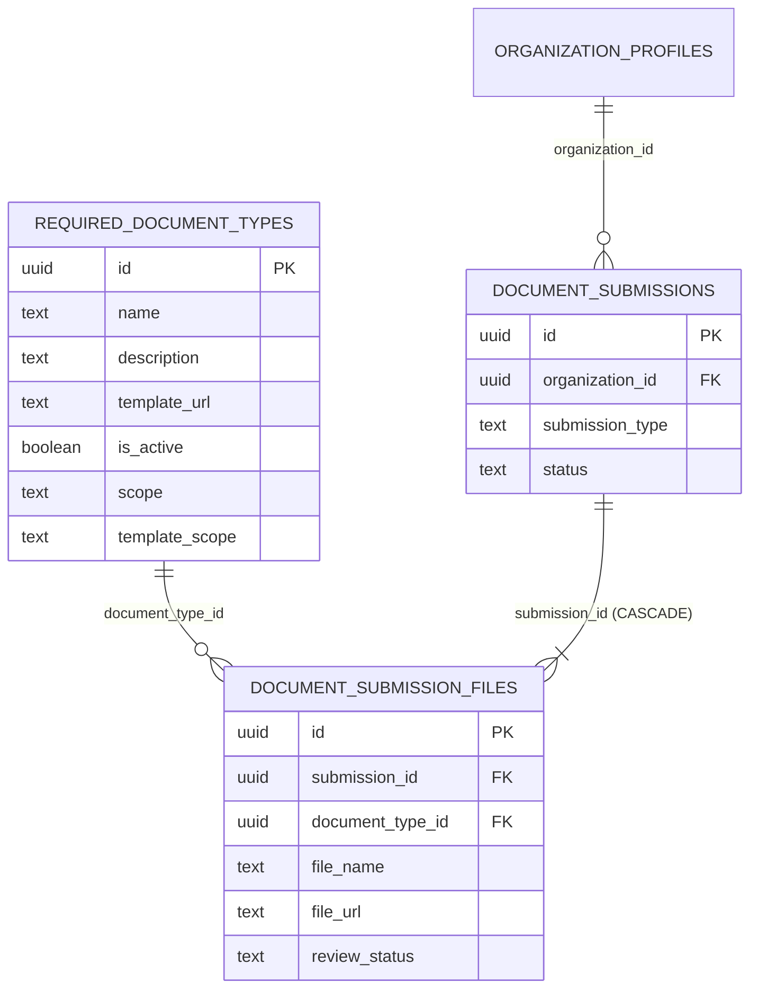

# Forms & Templates Inspection Report

**Target**: Admin Portal → Forms & Templates  
**Document Purpose**: Comprehensive technical inspection of the Forms & Templates data model, archive filter behavior, delete flow, database foreign key constraints, submission dependencies, and safe implementation options.  
**Execution Type**: Inspection-Only (No application code or database schema modified in this step).

---

## 1. Forms & Templates Architecture Found

### Application Architecture Overview
The Forms & Templates management module allows Admins to view, upload, edit, categorize, preview, archive, restore, and permanently delete document templates used across the organization portal (registration, renewal, budget, liquidation, and downloadable templates).

```
Admin Portal UI (<AdminPortal />)
       │
       └── Forms & Templates Tab
               │
               ├── Status Filter Tabs ("All Status", "Active", "Archived")
               ├── Search & Category Filters
               └── <TemplatesTable />
                       │
                       ├── Category Grouping (orderTemplateCategories, visibleGroups)
                       ├── Group Rows (<StatusPill />, File Swatch, Size, Actions)
                       └── Row Action Menu (Preview, Edit, Archive, Restore, Delete)
                               │
                               └── <DangerConfirmDialog /> (Confirmation modals)
```

### Data Synchronization Flow
1. **Initial Load**:
   - `LydoConnectStore` (`src/lib/lydo-connect-store.tsx`) initializes with `normalizeTemplates(seed.templates)`.
   - `loadAdminPortalSupabaseState` (`src/lib/lydo-connect-supabase.ts`) queries:
     - `get_admin_portal_snapshot` RPC.
     - Direct table SELECT on `required_document_types` (`adminTemplatesPromise`).
   - Direct table query results (`adminTemplateRows`) populate `remoteState.templates` and are merged into `LydoConnectStore`.
2. **Local Derived State**:
   - `filteredTemplates` in `AdminPortal.tsx` memoizes over `state.templates`, `templateSearch`, `templateStatusFilter`, and `templateCategoryFilter`.
   - `TemplatesTable` groups `filteredTemplates` by category using `orderTemplateCategories` and displays grouped rows.

---

## 2. Relevant Files

| File Path | Role / Architecture Layer |
| --- | --- |
| `src/admin/AdminPortal.tsx` | Admin page containing filter states (`templateStatusFilter`, `templateSearch`, `templateCategoryFilter`), memoized `filteredTemplates`, delete/archive/restore handlers, and confirmation dialogs. |
| `src/admin/components/TemplatesTable.tsx` | Table component rendering search input, status tabs, category dropdown, grouped template rows, status pills, and dropdown action menus. |
| `src/components/portal/DangerConfirmDialog.tsx` | Reusable modal dialog for archive, delete, and restore confirmation with async loading and pointer-events safety. |
| `src/lib/lydo-connect-data.ts` | Type definitions (`TemplateRecord`, `RequiredDocumentTypeRow`), category normalization, seed templates, and category sorting utilities. |
| `src/lib/lydo-connect-store.tsx` | Central state management store (`normalizeTemplates`, `createTemplate`, `updateTemplate`, `removeTemplate`, `mergeRemoteState`). |
| `src/lib/lydo-connect-supabase.ts` | Supabase client functions (`loadAdminPortalSupabaseState`, `deleteTemplateRecordInSupabase`, `permanentlyDeleteTemplateRecordInSupabase`, `reactivateTemplateRecordInSupabase`, `mapTemplate`). |
| `supabase/repair_template_archive_and_category.sql` | SQL definitions for template RPCs (`hard_delete_admin_template_document`, `deactivate_admin_template_document`, `reactivate_admin_template_document`, `update_admin_template_category`). |
| `supabase/migrations/20260916160000_admin_portal_snapshot_include_archived_templates.sql` | Redefinition of `get_admin_portal_snapshot` to include both active and archived templates. |
| `supabase/migrations/20260907160000_phase2_renewal_workflow_rpcs.sql` | Document submission and renewal RPCs referencing `required_document_types`. |
| `supabase/migrations/20260918050000_auto_verify_registration_on_required_docs_approved.sql` | Registration workflow logic joining `required_document_types` and `document_submission_files`. |

---

## 3. Current Status Model

### Database Representation
The `public.required_document_types` table stores template status using a single boolean column:
- Column: `is_active` (`boolean NOT NULL DEFAULT true`)
- Values:
  - `true` → Active (available for user submission workflows and active admin management)
  - `false` → Archived / Deactivated (hidden from user upload requirements; retained in admin archive)

### TypeScript Data Model
`TemplateRecord` in `src/lib/lydo-connect-data.ts`:
```ts
export type TemplateRecord = {
  id: string; // Local identifier / slug (e.g. 'yorp-members', 'doc-1')
  databaseId: string; // Database UUID (e.g. 'b1654a41-4952-4317-809d-dcb8468f2e5b')
  name: string;
  description: string;
  templateUrl: string;
  sortOrder: number;
  isRequired: boolean;
  isActive: boolean; // Authoritative active boolean
  scope: "registration" | "renewal" | "both";
  templateScope: "document_submission" | "other";
  templateDescription?: string;
  templateActive?: boolean; // Legacy mirror of isActive
  templateFileName?: string;
  templateFileUrl?: string;
  templateFileType?: string;
  templateUploadedAt?: string;
  templateCategories?: string[];
  templateFileSize?: number | null;
};
```

---

## 4. Current Archive Filter Logic

### Client Filter Implementation
In `src/admin/AdminPortal.tsx`:
```tsx
const [templateStatusFilter, setTemplateStatusFilter] = useState<TemplateStatusFilter>("all");

const filteredTemplates = useMemo(() => {
  const query = templateSearch.trim().toLowerCase();
  return [...state.templates]
    .filter((template) => {
      const matchesSearch =
        !query ||
        [template.name, template.description, template.templateFileName]
          .join(" ")
          .toLowerCase()
          .includes(query);
      const matchesStatus =
        templateStatusFilter === "all" ||
        (templateStatusFilter === "active" ? template.isActive : !template.isActive);
      const categories =
        Array.isArray(template.templateCategories) && template.templateCategories.length > 0
          ? template.templateCategories.filter(Boolean)
          : [deriveTemplateCategory(template.name)];
      const matchesCategory = templateCategoryFilter === "all" || categories.includes(templateCategoryFilter);
      return matchesSearch && matchesStatus && matchesCategory;
    })
    .sort((left, right) => left.sortOrder - right.sortOrder);
}, [state.templates, templateSearch, templateStatusFilter, templateCategoryFilter]);
```

---

## 5. Why Active Items Can Appear in Archive (Root Cause Analysis)

### Root Causes Identified
1. **Legacy Snapshot Query Exclusion**:
   - Earlier versions of `get_admin_portal_snapshot()` included `where rdt.is_active = true` in the SQL query. When an admin archived a template, the server snapshot returned no record for that template. The client fell back to local seed data, which initialized all templates with `isActive: true`.
2. **Store Identifier & Deduplication Coexistence**:
   - `normalizeTemplates()` previously indexed by `template.databaseId || template.id`. If a record was present in seed state with `id: "doc-1"` and in Supabase with `databaseId: "uuid-1"`, both objects coexisted in `state.templates`. When filtering, one active entry remained visible even if the other was marked archived.
3. **Property Name Discrepancy**:
   - In some legacy code paths, `template.templateActive` vs `template.isActive` vs `template.is_active` were referenced interchangeably. If a patch updated `templateActive` but not `isActive`, `template.isActive` remained `true`.

---

## 6. Correct Archive Semantics

| Filter Tab | Condition | Behavior |
| --- | --- | --- |
| **All Status** | `templateStatusFilter === "all"` | Displays all records regardless of `isActive` status. |
| **Active** | `template.isActive === true` | Displays only active templates available for user upload workflows. |
| **Archived** | `template.isActive === false` | Displays only deactivated templates. Active templates are strictly excluded. |

---

## 7. Current Delete Flow

```
1. User clicks "Delete" on row
   │
2. Dropdown item triggers onDelete(template)
   │
3. AdminPortal sets pendingDeleteTemplate = template
   │
4. <DangerConfirmDialog /> renders confirmation modal
   │
5. Admin clicks "Delete File"
   │
6. AdminPortal.handlePermanentlyDeleteTemplate(template.id)
   │
   ├── Step A: permanentlyDeleteTemplateRecordInSupabase(template.databaseId, template.name)
   │       └── RPC: hard_delete_admin_template_document(_session_token, _template_id)
   │
   ├── Step B: removeTemplate(template.id) & removeTemplate(template.databaseId)
   │       └── Local state store purges the item from state.templates
   │
   ├── Step C: appendAuditLog("Deleted file", "template", template.databaseId, ...)
   │       └── Inserts activity log entry
   │
   └── Step D: refreshAdminState()
           └── Refetches remote state from Supabase to sync authoritative database state
```

---

## 8. Why Delete Fails When Submissions Exist

When an Admin attempts to permanently delete a form/template that has user submissions attached:

1. **Explicit RPC Guard**:
   In `hard_delete_admin_template_document`:
   ```sql
   select count(*)
   into _referenced_file_count
   from public.document_submission_files
   where document_submission_files.document_type_id = _template_id;

   if _referenced_file_count > 0 then
     raise exception 'This template has submitted documents attached and can''t be permanently deleted — archive it instead.';
   end if;
   ```
2. **PostgreSQL Foreign Key Constraint**:
   - Table `public.document_submission_files` has a foreign key referencing `public.required_document_types(id)`:
     `CONSTRAINT document_submission_files_document_type_id_fkey FOREIGN KEY (document_type_id) REFERENCES public.required_document_types(id) ON DELETE RESTRICT` (or `NO ACTION`).
   - If the RPC guard were removed without modifying the database foreign key constraint, PostgreSQL would throw error `23503: foreign_key_violation` (`update or delete on table "required_document_types" violates foreign key constraint on table "document_submission_files"`).

---

## 9. All Submission & Template Foreign Keys



---

## 10. Delete Constraints Table

| Constraint / Rule | Target Table & Column | Current Behavior | Implication for Hard Deletion |
| --- | --- | --- | --- |
| `RPC File Count Guard` | `hard_delete_admin_template_document` | Checks `COUNT(*) FROM document_submission_files WHERE document_type_id = _template_id` and raises exception if > 0. | Explicitly blocks execution in Postgres before DELETE statement runs. |
| `Foreign Key Constraint` | `document_submission_files(document_type_id) → required_document_types(id)` | Default `ON DELETE RESTRICT` / `NO ACTION`. | Deletion of referenced row is rejected by Postgres relational engine. |
| `NotNullability (if any)` | `document_submission_files.document_type_id` | Foreign key column storing reference. | Must be nullable if `ON DELETE SET NULL` is adopted. |

---

## 11. Storage Dependencies

1. **Template Files Bucket (`template-files`)**:
   - Storage path: `storage://template-files/{uuid}/{filename}`.
   - Contains administrative downloadable sample/template files (PDF, XLSX).
   - Deleting a template record from `required_document_types` can optionally remove the associated file from `template-files` storage bucket.
2. **Document Submissions Bucket (`document-submissions`)**:
   - Storage path: `storage://document-submissions/{organization_id}/{submission_id}/{file_id}.pdf`.
   - Contains actual organization-uploaded verification files (Constitution & By-Laws, Officer Rosters, Financial Statements).
   - **Critical Rule**: Deleting a form/template definition must **NEVER** delete or alter files in `document-submissions`.

---

## 12. Historical Submission Dependencies

When an organization submits documents, the submission pipeline creates:
1. `document_submissions` (the parent registration or renewal container).
2. `document_submission_files` records containing:
   - `file_name`: String containing original file name (e.g. `2026-YORP-Directory-of-Officers.pdf`).
   - `file_url`: Supabase storage URI.
   - `file_size`, `file_type`.
   - `review_status`, `admin_remarks`.
   - `document_type_id`: UUID pointing to `required_document_types.id`.

### Impact of Template Deletion on Historical Submissions
- Review interfaces (e.g. `RegistrationsTable.tsx`, `DocumentReviewDrawer.tsx`) query submission files with SQL:
  ```sql
  select
    dsf.*,
    coalesce(rdt.name, dsf.file_name) as display_name
  from public.document_submission_files dsf
  left join public.required_document_types rdt on rdt.id = dsf.document_type_id
  ```
- Because `coalesce(required_document_types.name, document_submission_files.file_name)` is used, historical records continue to display their submitted file name even if `rdt.name` is null.
- **Requirement**: If `document_type_id` is set to `NULL` upon template deletion, historical submissions preserve complete access to their uploaded file, file URL, review status, and display name without breaking.

---

## 13. RLS & Admin Authorization

- All administrative template management operations run through Postgres `SECURITY DEFINER` RPCs:
  - `hard_delete_admin_template_document(_session_token text, _template_id uuid)`
  - `deactivate_admin_template_document(_session_token text, _template_id uuid)`
  - `reactivate_admin_template_document(_session_token text, _template_id uuid)`
  - `update_admin_template_category(_session_token text, _template_id uuid, _template_category text[])`
- Each RPC validates the session token via `public.validate_admin_session_token(_session_token)`.
- If `_admin_id` is null, the RPC raises `Admin account is not authorized.`.
- Direct table access to `required_document_types` is protected by RLS: public users have read-only access to active templates, while mutations require authenticated admin session context.

---

## 14. Activity Log & Audit Behavior

- When a template is archived:
  `appendAuditLog("Archived file", "template", template.databaseId, 'Archived file "[name]".')`
- When a template is restored:
  `appendAuditLog("Restored file", "template", template.databaseId, 'Restored file "[name]".')`
- When a template is deleted:
  `appendAuditLog("Deleted file", "template", template.databaseId, 'Permanently deleted file "[name]".')`
- Audit log records store `target_type: "template"` and `target_id: template.databaseId`. Because `activity_logs` stores `target_id` as raw text without a hard foreign key constraint, deleting the template does not violate or break audit log history.

---

## 15. Safe Implementation Options for Future Deletion Task

### Option 1: Foreign Key `ON DELETE SET NULL` + Disassociation (Recommended)
1. Alter foreign key constraint on `document_submission_files`:
   ```sql
   alter table public.document_submission_files
     drop constraint if exists document_submission_files_document_type_id_fkey,
     add constraint document_submission_files_document_type_id_fkey
       foreign key (document_type_id) references public.required_document_types(id)
       on delete set null;
   ```
2. Update `hard_delete_admin_template_document` RPC:
   - Remove the `_referenced_file_count > 0` exception check.
   - Disassociate any referencing rows (`UPDATE public.document_submission_files SET document_type_id = NULL WHERE document_type_id = _template_id`).
   - Execute `DELETE FROM public.required_document_types WHERE id = _template_id`.
3. **Pros**: Clean relational design, preserves all submission files, historical file names, review remarks, and audit history.

### Option 2: Soft-Deletion / Tombstone Pattern
1. Add `deleted_at timestamptz` to `required_document_types`.
2. When deleted, set `deleted_at = now()`, `is_active = false`.
3. Exclude `deleted_at is not null` records from all Admin Portal lists and snapshots.
4. **Pros**: No foreign key modifications required; preserves original document type metadata indefinitely.
5. **Cons**: Record remains in `required_document_types` table (soft-deleted rather than true hard deletion).

---

## 16. Recommended Implementation Approach

Adopt **Option 1 (Relational Disassociation with `ON DELETE SET NULL`)**:
1. Create a Supabase database migration that:
   - Sets `document_submission_files.document_type_id` foreign key constraint to `ON DELETE SET NULL`.
   - Redefines `public.hard_delete_admin_template_document` to remove the blocking file count check.
2. In the frontend:
   - Ensure `DangerConfirmDialog` for delete displays clear warning text that historical submitted documents will be preserved with disassociated type metadata.
   - Retain existing audit logging and store synchronization flows.

---

## 17. Exact Files That Would Need Modification (For Future Task)

1. `supabase/migrations/20260919000000_allow_template_deletion_with_submissions.sql` (New Migration):
   - Alter `document_submission_files.document_type_id` constraint to `ON DELETE SET NULL`.
   - Update `hard_delete_admin_template_document` RPC.
2. `src/lib/lydo-connect-supabase.ts`:
   - Verify RPC error handling in `permanentlyDeleteTemplateRecordInSupabase`.
3. `src/admin/AdminPortal.tsx`:
   - Adjust delete dialog description/warning if necessary.

---

## 18. Manual Test Scenarios

1. **Verify Archive Filter Accuracy**:
   - Navigate to `Admin Portal → Forms & Templates`.
   - Select **Active** filter → Verify only active templates are displayed.
   - Select **Archived** filter → Verify only archived/deactivated templates are displayed; no active items appear.
   - Select **All Status** → Verify all templates appear.
2. **Delete Template With No Submissions**:
   - Create a test template.
   - Delete the test template → Verify it is permanently removed immediately without errors.
3. **Delete Template With Existing Submissions Attached**:
   - Identify an existing template with submitted documents in Registration or Renewal.
   - Click Three-Dots → `Delete` → Confirm `Delete File`.
   - Verify:
     - Deletion succeeds without RPC exception or foreign key violation.
     - The template row immediately disappears from the table.
     - Success toast appears.
4. **Inspect Historical Submissions After Deletion**:
   - Navigate to `Admin Portal → Registrations` and `Renewals`.
   - Open submissions that originally used the deleted template.
   - Verify all submitted files, file download links, file names, review statuses, and admin remarks remain intact and accessible.
